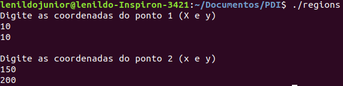
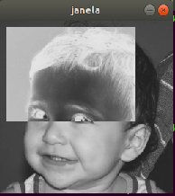

= Projetos - Processamento Digital de Imagens
José Lenildo Fernandes Dantas Júnior <lenildo.ze@gmail.com>

== Projetos da Primeira Unidade

:sectnums

== Manipulação de Pixels

:sectnums:

=== Negativo de uma região

Este exercício tem como finalidade manipular uma determinada imagem de forma que, após receber duas coordeandas (x,y) que representam, respectivamente, o ponto inicial e final da área desejada, forme um retângulo onde será aplicado o negativo da imagem.

image::Retangulo.cpp[]

O conceito e negativo de uma imagem está atrelado ao fato de acessar os pixels da imagem e subtrair dele o valor máximo que ele pode assunmir. No caso deste exercício, estaremos utilizando uma imagem em tons de cinza com armazenamento de 1 byte, ou seja, cada pixel pode assumir valores entre 0 e 255. Com isso o negativo da imagem pode ser definido como

[source,cpp]
----
image.at<uchar>(i,j)=255-image.at<uchar>(i,j);
----

onde:

* *_image_* : Refere-se a imagem manipulada
* *_.at<uchar>_* : Método para acesso aos pixels de um _unsigned char_ (<uchar>) com 1 _byte_ de tamanho
* *_(i,j)_* : Representam as coordenadas (x,y) do pixel 

Para aplicar este efeito em toda a imagem, basta acrescentá-la a um laço _for()_ como mostra o trecho do código

[source,cpp]
----
for(int i=p1x;i<p2x;i++){
    for(int j=p1y;j<p2y;j++){
      image.at<uchar>(i,j)=255-image.at<uchar>(i,j);
    }
  }
----

O resultado da execução deste programa pode ser visto abaixo

.Imagem utilizada na execução do programa
image::biel.png[]

.Pontos informados pelo usuário

.Imagem gerada na saída

